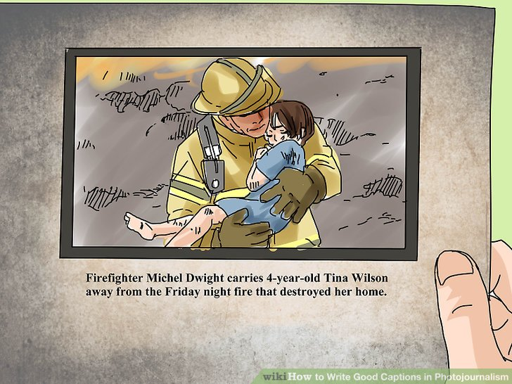

# Image-Captioning
NLP Application using InceptionV3 and LSTM

- Used InceptionV3 pre-trained model for pre-processing the image and get the featured vector by excluding the last layer of output
- Used LSTM model for pre-processing the text data
- Finally evaluated the result using metrics like blue-score and rouge
